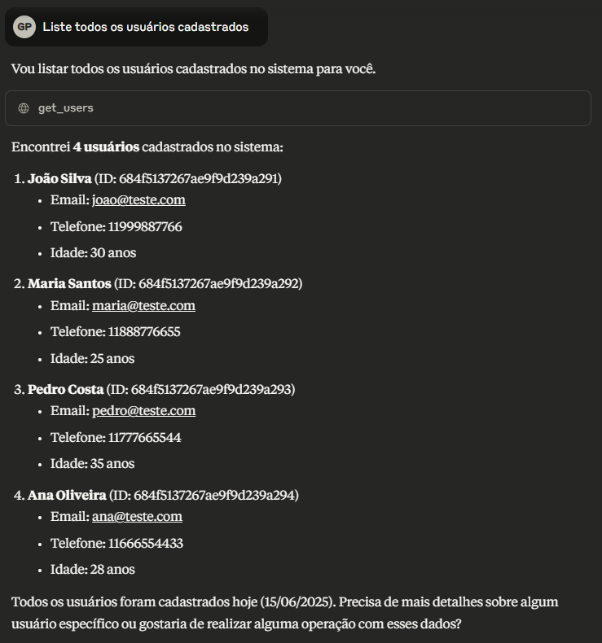
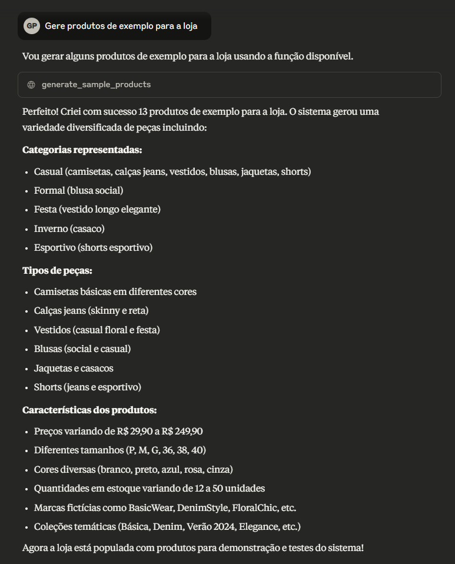
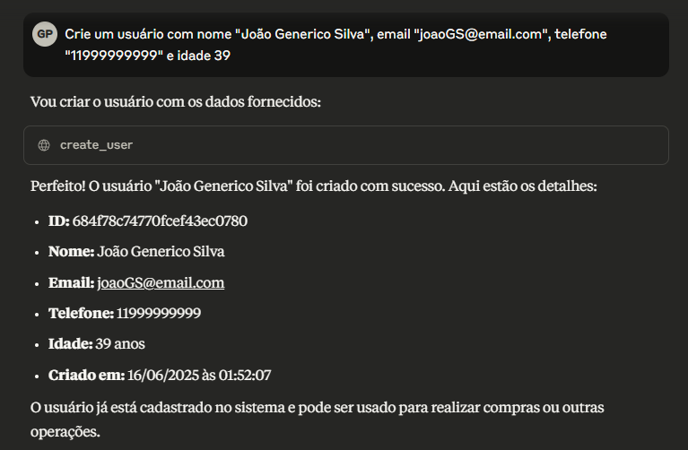
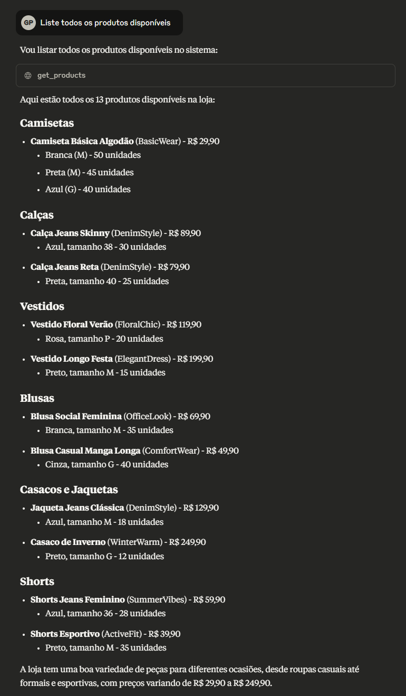
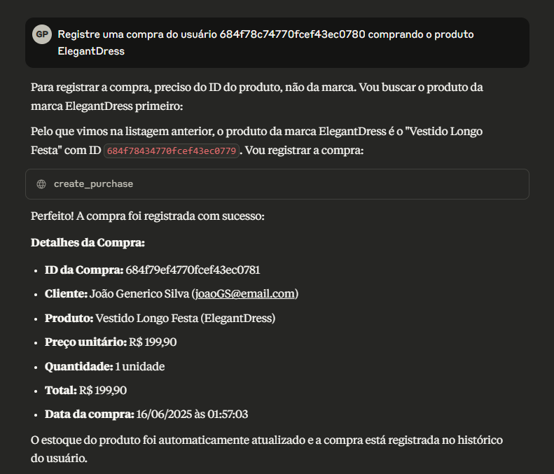
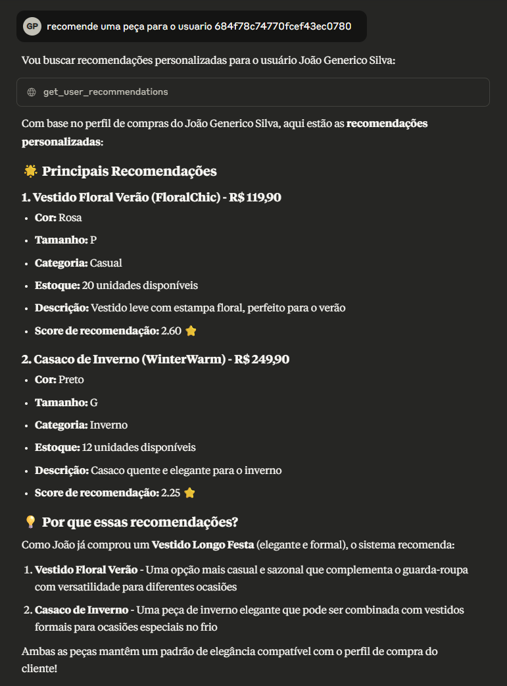
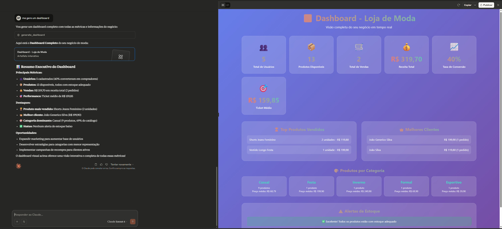
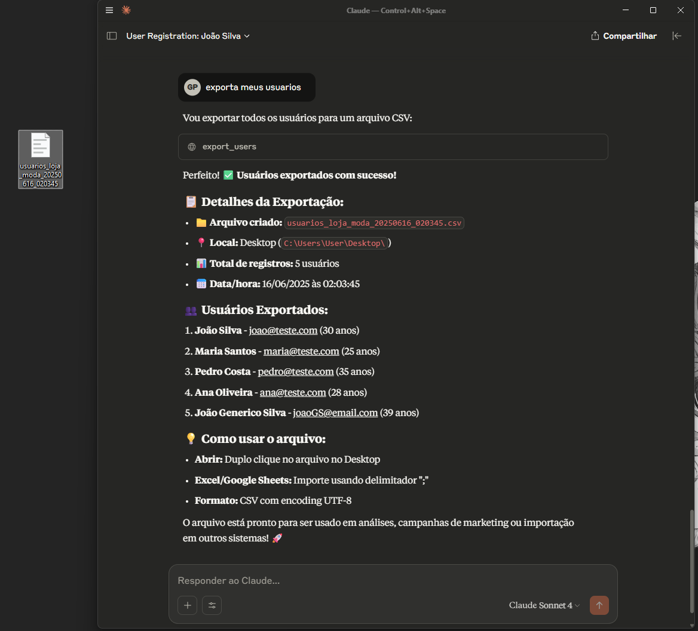

# 🏪 MCP Store Management System

> **⚠️ PROOF OF CONCEPT**  
> Este projeto é uma **prova de conceito (PoC)** desenvolvida para demonstrar as capacidades de integração entre o Model Context Protocol (MCP) e o Claude Desktop. O objetivo é mostrar como sistemas de gerenciamento empresarial podem ser integrados diretamente ao Claude para automação e análise de dados.

Sistema completo de gerenciamento de loja com integração MCP (Model Context Protocol) para uso com Claude Desktop. Este projeto oferece funcionalidades completas para gerenciar usuários, produtos, compras e recomendações através de conversas naturais.

## 📋 Índice

- [🚀 Características](#-características)
- [📦 Pré-requisitos](#-pré-requisitos)
- [🗄️ Instalação do MongoDB](#️-instalação-do-mongodb)
- [⚙️ Configuração do Projeto](#️-configuração-do-projeto)
- [🔧 Configuração no Claude Desktop](#-configuração-no-claude-desktop)
- [🎯 Como Usar](#-como-usar)
- [🛠️ Funcionalidades Disponíveis](#️-funcionalidades-disponíveis)
- [📊 Estrutura do Banco](#-estrutura-do-banco)
- [🔍 Troubleshooting](#-troubleshooting)
- [📞 Suporte](#-suporte)

## 🚀 Características

✨ **Principais Funcionalidades:**
- **Gerenciamento de Usuários**: CRUD completo com validações
- **Catálogo de Produtos**: Gestão de produtos com categorias, cores, tamanhos
- **Sistema de Compras**: Registro automático com controle de estoque
- **Recomendações IA**: Sistema inteligente baseado no histórico
- **Dashboard Analytics**: Métricas completas e visualizações
- **Exportação de Dados**: CSV direto para o Desktop
- **Operações em Lote**: Múltiplas operações em uma única chamada
- **Integração MCP**: Uso natural através de conversas com Claude

🎯 **Diferenciais:**
- Interface conversacional natural
- Validações automáticas de dados
- Sistema de recomendações personalizado
- Exportação automática para Desktop
- Dashboard completo de negócios

## 📦 Pré-requisitos

- **Python 3.8+** - Linguagem principal
- **MongoDB** - Banco de dados (local ou remoto)
- **Claude Desktop** - Para integração MCP
- **Windows/macOS/Linux** - Suporte multiplataforma

## 🗄️ Instalação do MongoDB

### 🖥️ Windows

**1. Download do MongoDB Community Server:**
```
📥 https://www.mongodb.com/try/download/community
- Selecione: Windows x64
- Clique em Download
```

**2. Instalação:**
```bash
# Execute o arquivo .msi baixado
# ✅ Marque "Complete installation"
# ✅ Marque "Install MongoDB as a Service"
# ✅ Marque "Install MongoDB Compass" (opcional - interface gráfica)
```

**3. Verificar instalação:**
```bash
# Testar se MongoDB está funcionando
mongod --version
mongosh --version

# Verificar se o serviço está rodando
net start MongoDB

# Conectar ao banco
mongosh
```

### 🍎 macOS

```bash
# Usando Homebrew (recomendado)
brew tap mongodb/brew
brew install mongodb-community

# Iniciar MongoDB
brew services start mongodb/brew/mongodb-community

# Conectar
mongosh
```

### 🐧 Linux (Ubuntu/Debian)

```bash
# Importar chave GPG
wget -qO - https://www.mongodb.org/static/pgp/server-7.0.asc | sudo apt-key add -

# Adicionar repositório
echo "deb [ arch=amd64,arm64 ] https://repo.mongodb.org/apt/ubuntu jammy/mongodb-org/7.0 multiverse" | sudo tee /etc/apt/sources.list.d/mongodb-org-7.0.list

# Instalar
sudo apt-get update
sudo apt-get install -y mongodb-org

# Iniciar serviço
sudo systemctl start mongod
sudo systemctl enable mongod

# Conectar
mongosh
```

## ⚙️ Configuração do Projeto

### 1. 📁 Preparar o Ambiente

```bash
# Navegar até a pasta do projeto
cd c:\Users\User\Desktop\code\mcp-ecommerce-poc

# Verificar se os arquivos estão presentes
# ✅ mcp_server.py (arquivo principal)
# ✅ README.md (este arquivo)
```

### 2. 📚 Instalar Dependências

```bash
# Alternativa: Instalar em ambiente virtual (recomendado)
python -m venv .venv
# Windows
.venv\Scripts\activate
# macOS/Linux
source .venv/bin/activate

# Instalar todas as dependências do projeto
pip install -r requirements.txt

```

### 3. 🔍 Testar MongoDB

```bash
# Verificar se MongoDB está rodando
mongosh --eval "db.runCommand('ping')"

# Deve retornar: { ok: 1 }
```

### 4. 🚀 Testar o Servidor MCP

```bash
# Testar se o servidor funciona
python mcp_server.py

# ✅ Deve mostrar: "Server listening on stdio..."
# 🛑 Ctrl+C para parar

# Nota: O servidor não precisa ficar rodando.
# O Claude Desktop inicia automaticamente quando necessário.
```

## 🔧 Configuração no Claude Desktop

### 1. 📍 Localizar Arquivo de Configuração

**Windows:**
```
%APPDATA%\Claude\claude_desktop_config.json
```

**macOS:**
```
~/Library/Application Support/Claude/claude_desktop_config.json
```

**Linux:**
```
~/.config/Claude/claude_desktop_config.json
```

### 2. ⚙️ Configurar MCP

Abra o arquivo `claude_desktop_config.json` e adicione/modifique:

```json
{
  "mcpServers": {
    "user-management": {
      "command": "C:\\Users\\User\\Desktop\\code\\mcp-ecommerce-poc\\.venv\\Scripts\\python.exe",
      "args": ["c:\\Users\\User\\Desktop\\code\\mcp-ecommerce-poc\\mcp_server.py"],
      "env": {}
    }
  }
}
```

**⚠️ Importante:** 
- Ajuste o caminho para sua instalação
- Use barras duplas (`\\`) no Windows
- Certifique-se de que o Python está no PATH

### 3. 🔄 Reiniciar Claude Desktop

```bash
# 1. Feche completamente o Claude Desktop
# 2. Use o Gerenciador de Tarefas para finalizar processos restantes
# 3. Abra novamente o Claude Desktop
# 4. Aguarde alguns segundos para a conexão MCP
```

### 4. ✅ Verificar Conexão

No Claude Desktop, teste com:
```
Liste todos os usuários cadastrados
```

Se funcionar, você verá uma resposta sobre usuários (mesmo que vazio).

**🖼️ Exemplo Visual:**



## 🎯 Como Usar

### 🏁 Primeiros Passos

**1. Gerar dados de exemplo:**
```
Gere produtos de exemplo para a loja
```

**🖼️ Exemplo Visual:**



*Claude gerando produtos de exemplo automaticamente*

**2. Criar primeiro usuário:**
```
Crie um usuário com nome "João Silva", email "joao@email.com", telefone "11999999999" e idade 30
```

**🖼️ Exemplo Visual:**



*Processo de criação de usuário via comando natural*

**3. Explorar produtos:**
```
Liste todos os produtos disponíveis
```

**🖼️ Exemplo Visual:**



*Visualização da lista de produtos com detalhes completos*

**4. Fazer primeira compra:**
```
Registre uma compra do usuário [ID_DO_USUARIO] comprando o produto [ID_DO_PRODUTO]
```

**💡 Dica:** Você pode usar o ID ou nome do produto.

**🖼️ Exemplo Visual:**



*Sistema processando uma compra e atualizando estoque automaticamente*

### 💬 Exemplos de Comandos

#### 👥 Gerenciamento de Usuários
```
# Criar usuário
"Crie um usuário com nome 'Maria Santos' e email 'maria@empresa.com'"

# Listar usuários
"Mostre todos os usuários cadastrados"

# Buscar usuário específico
"Busque o usuário com ID [ID_AQUI]"

# Atualizar usuário
"Atualize o usuário [ID] alterando o telefone para '11987654321'"

# Deletar usuário
"Delete o usuário com ID [ID]"
```

#### 📦 Gestão de Produtos
```
# Criar produto
"Crie um produto chamado 'Camiseta Premium' com preço 79.90, categoria 'Casual' e cor 'Azul'"

# Buscar produtos
"Mostre produtos da categoria 'Formal'"
"Busque produtos com preço entre 50 e 100 reais"
"Quais produtos estão em estoque?"

# Atualizar estoque
"Atualize o produto [ID] alterando o estoque para 50 unidades"
```

#### 🛒 Sistema de Compras
```
# Registrar compra
"Registre uma compra do usuário [USER_ID] do produto [PRODUCT_ID] com quantidade 2"

# Histórico de compras
"Mostre o histórico de compras do usuário [USER_ID]"
"Mostre as últimas 20 compras da loja"
```

#### 💡 Recomendações e Analytics
```
# Recomendações personalizadas
"Gere recomendações para o usuário [USER_ID]"
```

**🖼️ Exemplo Visual:**



*IA gerando recomendações personalizadas baseadas no histórico de compras*

### 📊 Dashboard e Relatórios

**🖼️ Exemplos de Analytics:**



*Visão geral do dashboard com métricas principais*



*Processo de exportação de dados para CSV no Desktop*

